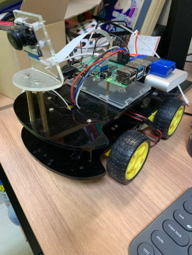
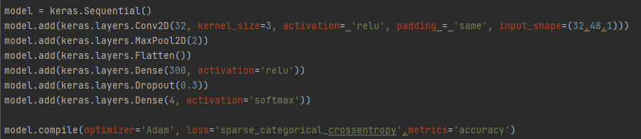

# END-TO-END self-driving using raspberry pi

## Final video

## Procedure

### Making training data

* Made image scale of 48x32 using raspberry pi camera. 

### Training model

* Made image gray to scale down the data and the model.
* Used CNN to train the model.

### Streaming the data with laptop and Raspberry Pi

* At first, I've tried to make the mini-car to decide direction but the trained-model was too heavy for Pi to run it.
* So I decided to receive the camera image from the Pi to my laptop and run the model in my laptop then send the decision to the Pi.
* It has reduced the decision making time 90% from 0.3s to 0.03s.

## Limitations
* I have reduced the decision making time by 0.03s but it wasn't enough since communication delay happened time to time.
* The car and the laptop should be nearby since I've decided to stream the data with laptop and Raspberry Pi.
* The car didn't had the steering system. So I had to control the car by spinning both wheel opposite direction.
* which made the motion of car simple but inefficient.

## What I've learned
* I've learned how the deep learning works, and how to apply deep learning in embedded system.
* I've got used to Python, embedded system.
* Honestly **I didn't know there was a thing called END-TO-END** driving until I finished this project.
* So I didn't used any references during the project, which made me learn how to implement the idea in my head.

